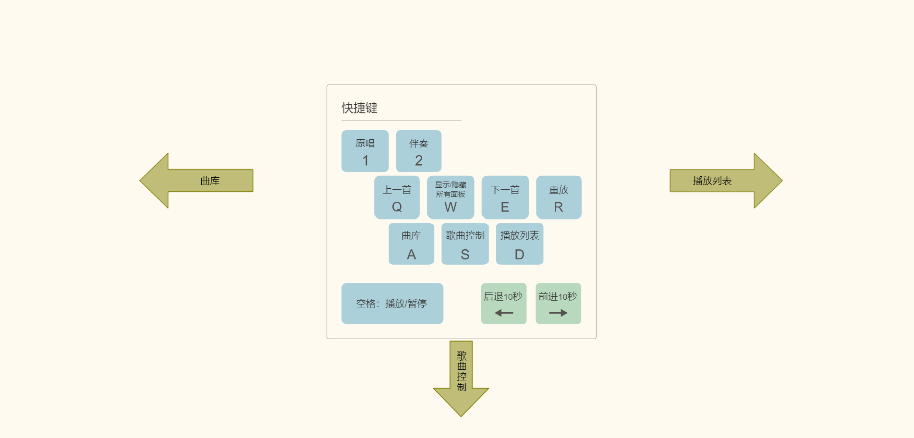

# Screenshots
## Desktop


## Mobile (for song-adding only)


# Build
`yarn install && npx webpack build`

# Media file name format
The server (`src/server.ts`) requires the names of the media files in a certain format. For example if you have a `{stem}.mpg`, you can generate the tracks with

```
ffmpeg -extra_hw_frames 32 -hwaccel cuda -hwaccel_output_format cuda -c:v mpeg2_cuvid -i '{stem}.mpg' -map 0:v -c:v h264_nvenc -profile:v high -preset p7 -tune:v hq -level 5 '{stem}.video.mp4' -map 0:a:0 -c:a aac -b:a 192k '{stem}.vocal.mp4' -map 0:a:1  -c:a aac -b:a 192k '{stem}.instrumental.mp4'
```