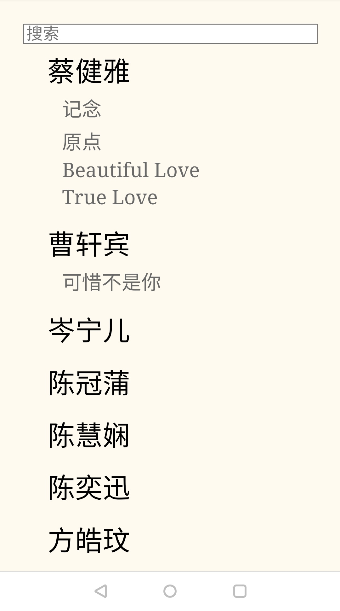

# Screenshots
## Desktop (main interface)


## Mobile (song-adding only)


# Build & Run
* Build: `yarn install && npx webpack build`
* Server: `cd dist && node server.js`
  * Before launching, put your video folder `videos` under `dist`
* Clients
  * Desktop: `http://localhost`
  * Mobile: `http://${IP_OF_YOUR_DESKTOP}`

# File name format of the media files
The server requires the names of the media files in a certain format (see `src/server.ts`). For example if you have a `{stem}.mpg`, you can generate the tracks with (if it has two audio tracks)

```
ffmpeg -extra_hw_frames 32 -hwaccel cuda -hwaccel_output_format cuda -c:v mpeg2_cuvid -i '{stem}.mpg' -map 0:v -c:v h264_nvenc -profile:v high -preset p7 -tune:v hq -level 5 '{stem}.video.mp4' -map 0:a:0 -c:a aac -b:a 192k '{stem}.vocal.mp4' -map 0:a:1  -c:a aac -b:a 192k '{stem}.instrumental.mp4'
```